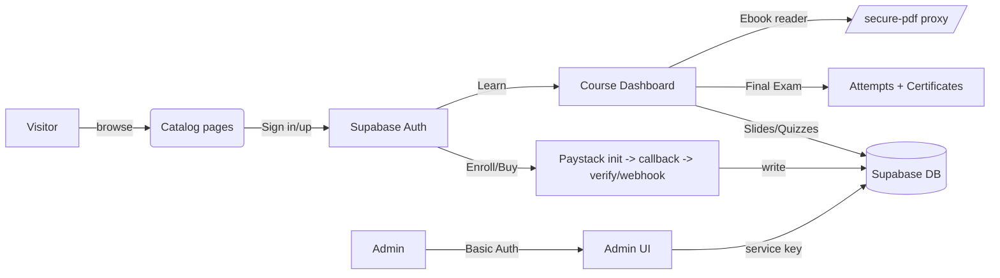

# PanAvest KDS – Audit Pack

## System Overview
- Public marketing/catalog site (Next.js App Router) listing courses (`/courses`, `/knowledge/[slug]`) and ebooks (`/ebooks`, `/ebooks/[slug]`), with auth flows (`/auth/sign-in`, `/auth/sign-up`, `/auth/reset`), dashboard (`/dashboard`), certificate verification (`/verify`), and privacy page.
- Learning modes: slide/video-based chapters plus interactive Storyline-style iframe player; per-chapter quizzes and a course-level final exam gate issue certificates.
- Commerce: Paystack-powered payments for courses/enrollments and ebooks, with callbacks/webhooks writing to Supabase tables and redirecting users back to the appropriate page.
- Admin dashboard (`/admin`) guarded by Basic Auth for course/ebook CRUD, content builder (chapters, slides, quizzes, exams), price editor, media uploads to Supabase Storage, user admin, and deploy hook trigger.
- Supabase used for auth, content storage, progress tracking, certificates, and ebook purchases; pdf.js-based inline readers and a client-side certificate generator (html2canvas + jsPDF).

## Architecture Map
- **Next.js App Router**: App directory with client-heavy pages for dashboard/learning, server-rendered home (`app/page.tsx` edge ISR) and static info pages. `middleware.ts` enforces Basic Auth on `/admin` and `/api/admin`.
- **Data layer**: Supabase JS SDK; anon client for public reads, service-role client for admin/server routes. `lib/supabaseClient.ts`, `lib/supabaseAdmin.ts`, `lib/supabase/server.ts`, `lib/supabaseServer.ts`.
- **Content structure**: Courses → Chapters → Slides; quizzes per chapter; final exam per course; certificates issued client-side. Ebooks stored separately with purchase checks.
- **Storage/Assets**: Supabase Storage uploads via `/api/admin/upload`; PDF worker served from `public/vendor/pdf.worker.min.mjs`; hero/background assets in `public/`.
- **Payments**: Paystack init/verify/callback/webhook routes; writes to `enrollments` or `ebook_purchases`.
- **Reader/Player**: `PdfPageViewer` renders PDFs inline; `InteractivePlayer` wraps interactive iframe; video slides use `<video controlsList="nodownload">`.
- **Admin UI tabs** (`app/admin/page.tsx`): `catalog` (courses/ebooks CRUD), `content` (chapters, slides, per-chapter quizzes, final exam questions/settings), `prices` (inline price editor), `media` (uploads), `users` (list/manage/bulk actions), `deploy` (trigger deploy hook).

## Security Model
- **Admin access**: `middleware.ts` enforces HTTP Basic Auth on `/admin` and `/api/admin` using `ADMIN_USER`/`ADMIN_PASS`. All admin routes run server-side and use Supabase service-role key (full bypass of RLS).
- **Auth**: Supabase email/password + magic links; client uses anon key; server/service clients use service-role for privileged writes. Course/quiz/exam progress and certificates are written from the browser with the anon key (RLS must restrict appropriately; not present in repo).
- **RLS/Policies**: Only explicit policy found is in `supabase/site_settings.sql` (`site_settings` readable by all; writes via service role). Other tables rely on Supabase defaults—assumed RLS needs to be manually configured; otherwise client writes are wide open.
- **Ebook protections**: `/api/ebooks/secure-pdf` enforces Supabase session + ownership in `ebook_purchases` before proxying PDF. Client reader disables context menu/copy/paste/print key combos and uses `controlsList="nodownload"` plus best-effort key/visibility guards. A generic `/api/secure-pdf` proxy streams arbitrary PDFs without auth (risk if misused).
- **Exam anti-abuse**: Final exam modal installs event listeners to block copy/context menu/print/back navigation and auto-submits on visibility loss; runs entirely client-side and records attempts via Supabase anon client.
- **Secrets**: Paystack secret used on server routes; service-role key used in many API handlers; admin credentials required for admin paths but not for other service-key-backed payment endpoints.
- **Certificates**: Issued client-side after passing exam; certificate number generated client or server; verification page fetches by `id` and shows basic details.
- **Download/print restrictions**: Ebook reader and video players set `controlsList="nodownload"` and intercept shortcuts; certificate preview downloadable via html2canvas/jsPDF (intended behavior).

## Data Model Summary
- **Courses/Structure**: `courses`, `course_chapters`, `course_slides`; `user_slide_progress` tracks slide completion; `enrollments` tracks paid flag, currency, intent amounts, progress.
- **Quizzes**: Per-chapter questions/settings in `chapter_quiz_questions`, `chapter_quiz_settings`; user results in `user_chapter_quiz`.
- **Exams**: Course-level `exams` + `questions`; attempts stored in `attempts` with score/passed + meta.
- **Certificates**: `certificates` (user_id, course_id, attempt_id, score_pct, certificate_no, issued_at); verified via `/verify`.
- **Ebooks**: `ebooks` catalog; purchases in `ebook_purchases` with `status`/`paid_at`.
- **Site config**: `site_settings` (public select RLS).
- **Profiles**: `profiles.full_name` required before certificate issuance.
- **Payments**: `payments` table referenced in SQL seed; Paystack flows update `enrollments` or `ebook_purchases` (not `payments`).
- **RLS locations**: Only `supabase/site_settings.sql` defines policies; all other tables need external RLS definitions (not found).

## Feature Map
| Feature | Main files | Routes | DB tables | Notes |
| --- | --- | --- | --- | --- |
| Course catalog & detail | `app/courses/page.tsx`, `app/knowledge/page.tsx`, `app/knowledge/[slug]/page.tsx` | `/courses`, `/knowledge/[slug]` | `courses`, `enrollments`, `user_slide_progress` | Shows price/CPPD, checks auth/enrollment to show enroll/continue buttons. |
| Course learning dashboard | `app/knowledge/[slug]/dashboard/page.tsx`, `components/pdf/PdfPageViewer.tsx`, `components/InteractivePlayer.tsx` | `/knowledge/[slug]/dashboard` | `course_chapters`, `course_slides`, `user_slide_progress`, `chapter_quiz_questions`, `chapter_quiz_settings`, `user_chapter_quiz` | Renders slides (video/pdf/html), interactive iframe, per-chapter quiz with timers/scoring and local progress cache. |
| Final exam & certificates | `app/knowledge/[slug]/dashboard/page.tsx`, `lib/client/issueCertificate.ts`, `lib/certificates.ts`, `components/SimpleCertificate.tsx`, `app/verify/page.tsx` | Exam modal in dashboard; `/verify` | `exams`, `questions`, `attempts`, `certificates`, `profiles` | Gates exam on slide+quiz completion; anti-cheat listeners; certificate issued client-side; verification page reads certificate. |
| Ebooks & reader | `app/ebooks/page.tsx`, `app/ebooks/[slug]/page.tsx`, `app/api/ebooks/*`, `app/api/secure-pdf/route.ts` | `/ebooks`, `/ebooks/[slug]` | `ebooks`, `ebook_purchases` | Paystack purchase flow + polling; secure-pdf route checks ownership; reader blocks copy/print and renders pdf.js pages. |
| Payments (Paystack) | `app/api/payments/paystack/init|callback|verify|webhook/route.ts`, `app/api/payments/course/initialize/route.ts` | `/api/payments/...` | `enrollments`, `ebook_purchases` | Init uses metadata (course/ebook); callback verifies and upserts paid status; webhook updates enrollments/purchases; course init legacy to hosted checkout. |
| Admin console | `app/admin/page.tsx` + API under `/api/admin/*`, `middleware.ts` | `/admin`, `/api/admin/*` | `courses`, `course_chapters`, `course_slides`, `chapter_quiz_*`, `exams`, `questions`, `ebooks`, `ebook_purchases`, `enrollments`, `user_*`, `site_settings` | Tabs: catalog CRUD; content builder; price editor; media upload (Supabase Storage); user management (ban/unban/reset/complete); deploy hook trigger. |
| Public site settings | `app/api/public/site-settings/route.ts`, `app/lib/public-data.ts` | `/api/public/site-settings` | `site_settings` | Cached anon read; writes only via admin/service role. |

## API Surface Map
| API Route | Method(s) | Auth | Purpose |
| --- | --- | --- | --- |
| `/api/ebooks` | GET | Public | List published ebooks. |
| `/api/ebooks/[slug]` | GET | Public | Fetch ebook by slug. |
| `/api/ebooks/secure-pdf` | GET | Supabase session + purchase check | Stream purchased PDF via Supabase RLS proxy. |
| `/api/secure-pdf` | GET | None | Generic PDF proxy with range support (no auth). |
| `/api/public/site-settings` | GET | Public | Return cached site settings. |
| `/api/debug-env` | GET | Public | Leak-check env presence (samples only). |
| `/api/interactive/ensure` | POST | Server/service role | Ensure interactive course has chapter/slide scaffold. |
| `/api/exams/attempt` | POST | Public | Disabled legacy endpoint (405). |
| `/api/certificates` | POST | Public | Disabled legacy endpoint (405). |
| `/api/certificates/[id]/refresh` | POST | Supabase session | Regenerate certificate number for owner. |
| `/api/payments/ebook` | POST | Public | Demo checkout redirect URL builder. |
| `/api/payments/paystack/init` | POST | Public → server-secret | Init Paystack transaction; upsert pending enrollment/purchase. |
| `/api/payments/paystack/callback` | GET | Paystack redirect | Verify transaction and mark enrollment/purchase; redirects to course/ebook page. |
| `/api/payments/paystack/verify` | GET | Public → server-secret | Poll Paystack verify and upsert paid status (course/ebook). |
| `/api/payments/paystack/webhook` | POST | Paystack signature | Validate HMAC; upsert paid enrollment/purchase. |
| `/api/payments/course/initialize` | GET/POST | Public → server-secret | Legacy Paystack initialize for courses with intent recording. |
| `/api/admin/knowledge` | GET/POST | Basic Auth + service role | List/create/update courses. |
| `/api/admin/knowledge/[id]` | DELETE | Basic Auth + service role | Delete course by id. |
| `/api/admin/chapters` | GET/POST | Basic Auth + service role | List/create/update chapters for a course. |
| `/api/admin/chapters/[id]` | DELETE | Basic Auth + service role | Delete chapter. |
| `/api/admin/slides` | GET/POST/DELETE | Basic Auth + service role | CRUD slides per chapter. |
| `/api/admin/slides/[id]` | DELETE | Basic Auth + service role | Delete slide. |
| `/api/admin/quiz-settings` | GET/POST | Basic Auth + service role | CRUD per-chapter quiz settings. |
| `/api/admin/quiz-questions` | GET/POST | Basic Auth + service role | CRUD per-chapter quiz questions. |
| `/api/admin/quiz-questions/bulk` | POST | Basic Auth + service role | Bulk CSV import of chapter quiz questions. |
| `/api/admin/exams` | GET/POST | Basic Auth + service role | Get best exam for course; upsert exam (one per course). |
| `/api/admin/exam-questions` | GET/POST/DELETE | Basic Auth + service role | CRUD exam questions; migrates legacy table if needed. |
| `/api/admin/exam-questions/bulk` | POST | Basic Auth + service role | Bulk CSV import of exam questions. |
| `/api/admin/ebooks` | GET/POST | Basic Auth + service role | List/upsert ebooks. |
| `/api/admin/ebooks/[id]` | DELETE | Basic Auth + service role | Delete ebook. |
| `/api/admin/upload` | POST | Basic Auth + service role | Upload to Supabase Storage bucket/folder. |
| `/api/admin/site-settings` | PUT | Basic Auth + service role | Update site theme/settings singleton. |
| `/api/admin/users` | GET/POST | Basic Auth + service role | List users; generate confirmation/reset links. |
| `/api/admin/users/[id]` | DELETE | Basic Auth + service role | Delete user. |
| `/api/admin/users/[id]/[action]` | POST | Basic Auth + service role | Actions: ban/unban/revoke/clear-history/delete. |
| `/api/admin/users/[id]/purchases` | GET/DELETE | Basic Auth + service role | List or revoke course/ebook purchases; clears related progress. |
| `/api/admin/users/[id]/reset-course` | POST | Basic Auth + service role | Clear progress/attempts/certificates for a course. |
| `/api/admin/users/[id]/complete-course` | POST | Basic Auth + service role | Mark course complete (progress + quiz rows). |
| `/api/admin/deploy` | POST | Basic Auth + service role | Trigger Vercel deploy hook. |

## Env Vars
| Env Var | Where used | Sensitivity |
| --- | --- | --- |
| `NEXT_PUBLIC_SUPABASE_URL` | Supabase clients (public and server) | Public (exposed in client bundle). |
| `NEXT_PUBLIC_SUPABASE_ANON_KEY` | Supabase anon client | Public (client bundle). |
| `SUPABASE_SERVICE_ROLE_KEY` | Service/admin clients, many API routes | Secret (server-only). |
| `SUPABASE_URL` | Fallback for admin client | Secret (server-only). |
| `ADMIN_USER`, `ADMIN_PASS` | `middleware.ts`, admin APIs | Secret (server-only). |
| `PAYSTACK_SECRET_KEY` | Paystack init/verify/callback/webhook, backups | Secret (server-only). |
| `NEXT_PUBLIC_APP_URL` | Paystack init callback URL | Public config. |
| `NEXT_PUBLIC_SITE_URL`, `NEXT_PUBLIC_BASE_URL` | Course initialize callback | Public config. |
| `NEXT_PUBLIC_SUPABASE_BUCKET` | Admin upload bucket name | Public config. |
| `NEXT_PUBLIC_UPLOADS_FOLDER` | Admin upload folder | Public config. |
| `VERCEL_DEPLOY_HOOK_URL` | `/api/admin/deploy` | Secret (server-only). |
| `VERCEL_PROJECT_PRODUCTION_URL`, `VERCEL_URL` | `/api/debug-env` reporting | Internal/secret-ish metadata. |

## Deployment Notes
- **Next.js** 15 App Router; `app/page.tsx` uses edge runtime + ISR (`revalidate=60`). Many API routes force Node runtime (`runtime = "nodejs"` or default).
- **Images**: `next.config.ts` allows Supabase Storage domains via `remotePatterns`.
- **Build/test**: `npm run build`, `npm run lint`, `npm run typecheck`; Tailwind v4/postcss config present.
- **Vercel**: Deploy hook supported via `VERCEL_DEPLOY_HOOK_URL`. No `vercel.json` found.
- **Common pitfalls**: Missing envs cause Supabase client throw (`NEXT_PUBLIC_SUPABASE_*` required); Paystack routes require `PAYSTACK_SECRET_KEY`; service-role key must be server-only. `pdf.worker.min.mjs` must exist under `public/vendor/`.

## High-Risk Areas & Recommended TODOs
- Service-role key used broadly in API routes reachable from the internet (even though server-side); ensure Vercel env scoping and consider moving privileged logic behind authenticated server actions with RLS instead of service role.
- RLS largely unspecified for learning/commerce tables; client-side writes to `attempts`, `certificates`, `ebook_purchases`, `enrollments`, progress tables rely on secure RLS—add policies to restrict to owner.
- `/api/secure-pdf` proxies arbitrary PDFs without auth; tighten or remove to avoid misuse/hotlinking.
- Paystack webhook/callback trust metadata from client; add signature/slug validation and amount checks, and ensure idempotency on upserts.
- Admin Basic Auth relies solely on env secrets; consider Supabase RBAC/session-based admin and rate limiting.
- Certificate issuance and exam attempts happen client-side; add server verification of scores/pass marks and store signatures for audit.
- Ebook reader copy/print blocking is best-effort; consider watermarking/streaming via signed URLs with short expiry.
